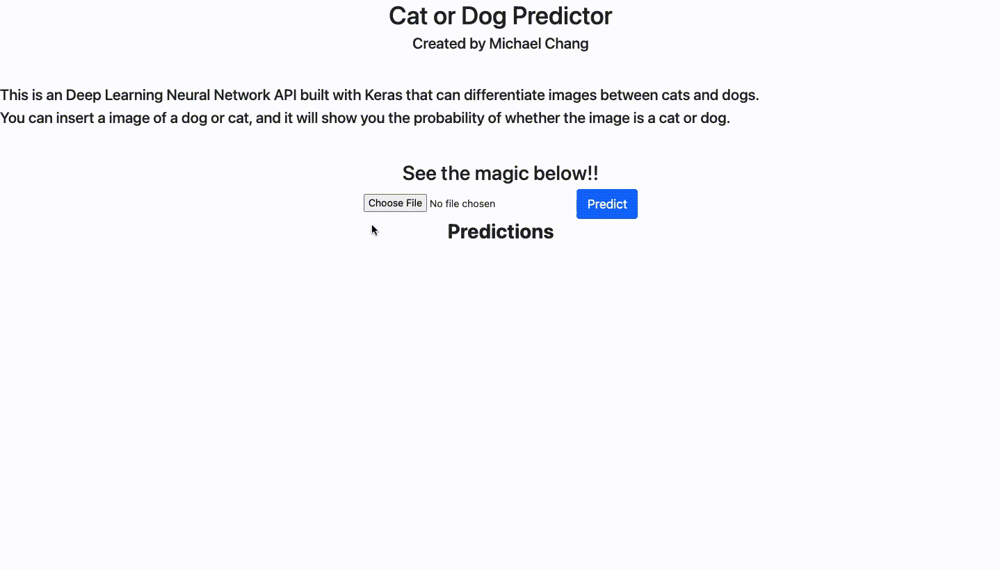

# Keras Cat or Dog Predictor API

- Using Tensorflow, Keras and Flask to develop a Deep Learning Neural Network API that can differentiate images between cats and dogs.
- Exploring the usage of Deep Neural Network and Image recognition applications with TensorFlow and Keras.



## How to run it 

- Download ```VGG16_cats_and_dogs.h5``` file [here](https://drive.google.com/file/d/19yICdtSbU_YkQBRxJ2if9KJwUL1oY5xs/view) (This file is too big to store on GitHub)
    - It contains the trained model that we need for this project

- Install everything you need from ```requirements.txt```

```
pip install -r requirements.txt
```

- Run the app

```
export FLASK_APP=app.py
flask run --host=0.0.0.0
```

- HAVE FUN!!!
